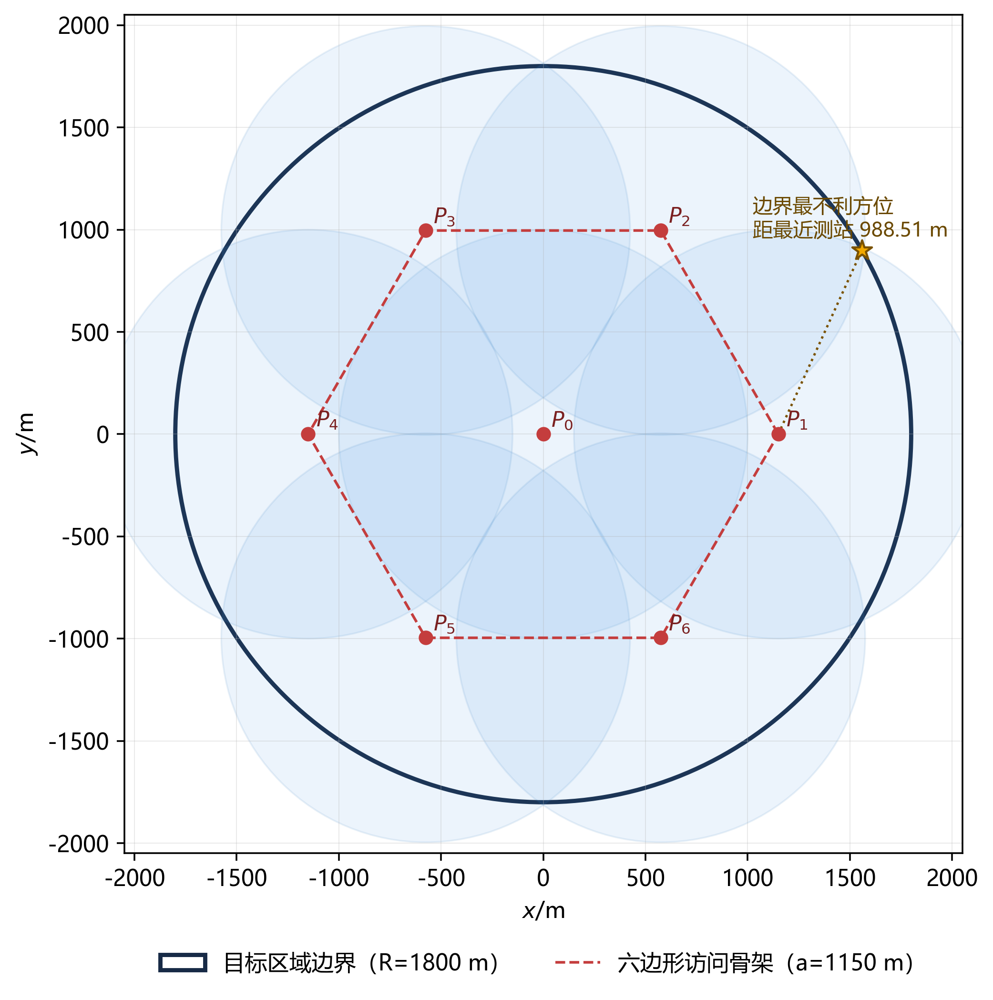
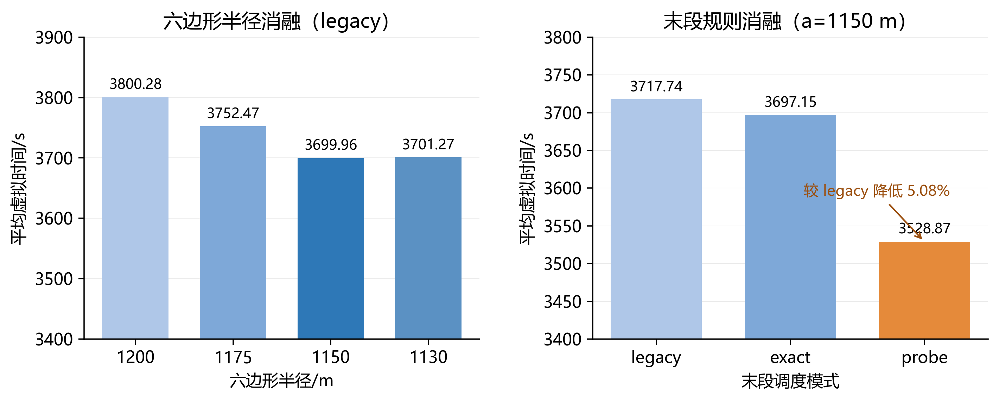

# 7 问题三：全向干扰源的自动搜索、定位与清除

## 7.1 问题分析与总体思路

问题三中，机器狗需在半径为 $1800\,\mathrm{m}$ 的圆形区域内，对 $20$ 个频道中数量、位置及有效接收半径均未知的 $10\sim16$ 个干扰源完成搜索、定位和清除。若将移动总路程记为 $L$，测向、换频、成功清除和失败清除的次数分别记为 $N_m,N_s,N_c,N_f$，则整局虚拟时间为

$$
T=\frac{L}{5}+5N_m+N_s+5N_c+3N_f. \tag{60}
$$

由式（60）可知，少移动 $1000\,\mathrm{m}$ 即可节省 $200\,\mathrm{s}$，移动代价明显高于单次换频代价。因此，本问不将“全域搜索”、“单源定位”和“多源清除”分解为三个相互独立的阶段，而是建立“保证覆盖—共享测向—联合开放巡回—安全清除”的滚动决策模型。每完成一个测站扫描或一个目标的定位清除后，根据新观测重新构造任务节点并规划路径，从而使覆盖移动同时服务于多频道交会定位和已发现目标的清除。

## 7.2 基于中心—正六边形的保证覆盖模型

为保证有效接收半径取最小值 $1000\,\mathrm{m}$ 时仍不漏检，在原点 $O$ 和半径为 $a$ 的正六边形顶点设置七个覆盖测站：

$$
P_0=O,\qquad
P_{k+1}=a\left(\cos\frac{k\pi}{3},\sin\frac{k\pi}{3}\right),
\quad k=0,1,\ldots,5. \tag{61}
$$

对于极坐标半径为 $r$ 的任意一点，其与最近六边形顶点的圆心角不超过 $30^\circ$。因而该点到最近测站的最坏距离可写为

$$
f(r)=\min\left\{r,\sqrt{r^2+a^2-\sqrt3ar}\right\}. \tag{62}
$$

中心测站与外层顶点等距的位置为 $r=a/\sqrt3$。结合顶点距离平方关于 $r$ 的凸性，全域的最坏覆盖距离为

$$
d_{\max}=\max\left\{\frac{a}{\sqrt3},
\sqrt{1800^2+a^2-\sqrt3\cdot1800a}\right\}. \tag{63}
$$

令 $d_{\max}\leq1000$，得到六边形半径的紧下界

$$
a_{\min}=1800\cos30^\circ-
\sqrt{1000^2-1800^2\sin^230^\circ}
\approx1122.956\,\mathrm{m}. \tag{64}
$$

本文取 $a=1150\,\mathrm{m}$。此时 $d_{\max}=988.511\,\mathrm{m}$，相对最小接收半径仍有约 $11.49\,\mathrm{m}$ 的覆盖余量；若按相邻顶点顺序访问且不返航，基础移动路程为 $6a=6900\,\mathrm{m}$。实际执行时，这七个点只构成必须最终完成的覆盖骨架，访问顺序由后文的联合开放巡回滚动决定。



**图 7　中心—正六边形测站及 $1000\,\mathrm{m}$ 保证覆盖圆**

## 7.3 频道状态与双层几何信息

对频道 $j$ 设置状态

$$
z_j\in\{U,D,L,C,E\}, \tag{65}
$$

其中 $U$ 为未知，$D$ 为已发现但尚未达到清除精度，$L$ 为已定位，$C$ 为已清除，$E$ 为经完整覆盖证书判定为空频道。主要状态转移为 $U\rightarrow D\rightarrow L\rightarrow C$ 或 $U\rightarrow E$；清除失败时，$L$ 可退回 $D$ 继续补测。

为避免将“当前点无信号”误判为“该频道不存在干扰源”，本文对未发现频道和已发现频道分别维护两类集合。

对未发现频道，以 $40\,\mathrm{m}$ 网格近似表示尚未被排除的存在区域 $S_j$。若在 $M_i$ 得到 `no_signal`，只利用最小接收半径排除确定不可能的部分：

$$
S_j\leftarrow S_j\setminus B(M_i,1000). \tag{66}
$$

仅当 $S_j=\varnothing$ 时才将频道置为 $E$。对已获得方向观测的频道，维护几何定位可行域

$$
U_j=D\cap\bigcap_i W(M_i,\theta_{ij},1^\circ), \tag{67}
$$

其中 $W(M_i,\theta_{ij},1^\circ)$ 为顶点在 $M_i$、中心方向为 $\theta_{ij}$、半张角为 $1^\circ$ 的测向楔形。利用问题一的半平面交算法更新 $U_j$，并计算其最小覆盖圆

$$
(c_j,\rho_j)=\arg\min_{c,\rho}\{\rho:U_j\subseteq B(c,\rho)\}. \tag{68}
$$

$c_j$ 是路径规划中的目标代表点，$\rho_j$ 是几何不确定半径，二者均由已有观测计算得到，不是在线已知的干扰源真值。

## 7.4 共享测站与多频道批量扫描

机器狗到达一个覆盖点后，首先扫描能够继续缩小 $S_j$ 的未知频道，同时对具有定位价值的已发现频道进行复测。频道 $j$ 在候选测站 $M$ 参与共享复测时需满足

$$
\min_i\|M-M_{ij}\|\geq50,
\qquad \|M-c_j\|\leq1500+\rho_j. \tag{69}
$$

前一条用于避免重复几乎相同的观测视角，后一条只排除与当前可行域距离过远、必然无法收到信号的测站。共享测站不会消除逐频道检测所需的 $5\,\mathrm{s}$ 测量时间与换频时间，但可将多个频道的定位任务合并到同一段移动中。扫描顺序采用“当前频道优先，其余频道递增”的规则，以减少无必要的频道切换。

## 7.5 覆盖与目标联合的滚动开放巡回

在任意决策时刻，设机器狗当前位置为 $x$，尚未访问的覆盖节点集为 $\mathcal P$，允许入队的已发现目标中心集为 $\mathcal C$，构造联合节点集 $\mathcal V=\mathcal P\cup\mathcal C$。在常规阶段，仅使 $\rho_j\leq150\,\mathrm{m}$ 的目标中心入队；覆盖节点不多于 $2$ 个时，放宽为所有已发现且可行域非空的频道。未发现频道尚无位置信息，因此不得使用事后得知的清除坐标参与当前规划。

对节点访问次序 $\pi$，建立不要求返回起点的开放旅行商模型：

$$
\min_{\pi}\left[
\|x-v_{\pi_1}\|+
\sum_{i=1}^{n-1}\|v_{\pi_i}-v_{\pi_{i+1}}\|
\right]. \tag{70}
$$

当 $n\leq10$ 时，采用 Held--Karp 动态规划精确求解本轮开放巡回。定义 $F(A,i)$ 为从 $x$ 出发、访问集合 $A$ 中的全部节点并停留在 $v_i$ 的最短路程，则

$$
F(\{i\},i)=\|x-v_i\|,
\qquad
F(A,i)=\min_{k\in A\setminus\{i\}}
\left[F(A\setminus\{i\},k)+\|v_k-v_i\|\right]. \tag{71}
$$

最终取 $\min_iF(\mathcal V,i)$，时间复杂度为 $O(n^22^n)$。当节点数超过 $10$ 时，先用最近邻获得初始路线，再通过 $2$-opt 反转子路径进行改进。

需要强调的是，每轮规划只执行路线中的首个任务，获得真实观测后立即更新状态并重新规划。因此，Held--Karp 保证的是“已知候选节点下本轮移动路程”的最优性，而非含未知目标与未来观测的整局期望时间最优性。整体方法仍是在覆盖完整性约束下的在线启发式决策。

## 7.6 末段粗定位目标的侧向补测

若始终只允许 $\rho_j\leq150\,\mathrm{m}$ 的目标参与排路，则已发现但不确定区域较大的目标可能被推迟到覆盖搜索结束后才处理，形成明显回绕。为此，当剩余覆盖点数不超过 $2$ 个，且首选目标满足 $\rho_j>150\,\mathrm{m}$ 时，沿该频道最近一次测向的单位垂线 $v_j$ 构造两个侧向候选补测点

$$
Q_j^{\pm}=c_j\pm150v_j. \tag{72}
$$

设 $B$ 为当前路线中预测的下一节点，在 $Q_j^+$ 和 $Q_j^-$ 中选择

$$
Q_j^*=\arg\min_{Q\in\{Q_j^+,Q_j^-\}}
\bigl(\|x-Q\|+\|Q-B\|\bigr). \tag{73}
$$

机器狗到达 $Q_j^*$ 后进行一次共享扫描，再依据新观测重排路径。每个频道最多触发一次这类附加补测，以防止粗估计在循环中重复产生侧向点。该侧向点并不保证测向成功，其作用是在小幅绕行下获得更好的交会角，并尽早将粗定位目标纳入全局路线。

## 7.7 局部定位、安全清除与网格兜底

当频道仅有一次有效测向时，复用问题二的后验网格与期望直径增益选择下一测站；若后验网格因数值近似而为空，则以首次测向方向单位向量 $u$ 及其法向量 $v$ 构造 $M_1+750u\pm600v$ 作为解析候选点。获得两次及以上有效测向后，通常在当前最小覆盖圆圆心 $c_j$ 复测，每次观测后都重新计算 $U_j$ 及 $(c_j,\rho_j)$。

若某次检测返回 `near`，说明当前指定测量位置与该频道干扰源相距不超过 $5\,\mathrm{m}$，因而立即在原地清除。否则，当

$$
\rho_j\leq19.8\,\mathrm{m} \tag{74}
$$

时在 $c_j$ 处执行清除。若测向误差界和几何裁剪成立，则真实位置 $I_j\in U_j\subseteq B(c_j,19.8)$，故其到清除点的距离严格小于 $20\,\mathrm{m}$，留出 $0.2\,\mathrm{m}$ 的数值余量。

当常规定位在限定补测次数内未收敛，或因数值近似导致清除失败时，使用边长为 $28\,\mathrm{m}$ 的方格中心覆盖剩余可行域。因为任一网格单元中的点到中心最远为

$$
\frac{28\sqrt2}{2}\approx19.799<20, \tag{75}
$$

故只要网格覆盖完整，就必存在至少一个可成功清除的网格中心。网格点按蛇形顺序访问，一旦清除成功即终止该频道的兜底任务。

## 7.8 完整算法

**算法 1　覆盖—定位—清除联合滚动算法**

```text
输入：圆形目标区域 D，频道集 J={1,…,20}
输出：所有频道均处于 cleared 或 absent 状态

1  初始化七个覆盖测站，并令所有频道状态为 unknown
2  while 存在非 cleared/absent 频道 do
3      由剩余覆盖点与允许入队的目标中心构造联合节点集
4      if 节点数不超过 10 then
5          用 Held--Karp 求解开放巡回
6      else
7          用最近邻 + 2-opt 求近似路线
8      end if
9      只执行路线首节点对应的任务
10     if 首节点为覆盖点 then
11         批量扫描需覆盖的未知频道，并共享复测已发现频道
12     else if 粗定位目标满足末段补测条件 then
13         在绕行代价较小的侧向点共享扫描
14     else
15         局部补测并更新可行域
16         if 返回 near 或最小覆盖圆半径不超过 19.8 m then
17             执行清除，并在清除位置共享复测其他已发现频道
18         else if 常规定位未收敛 then
19             用 28 m 网格覆盖剩余可行域并依次尝试
20         end if
21     end if
22     根据真实返回结果更新频道状态和几何集合
23  end while
24  退出并保存完整路径和动作日志
```

算法中，覆盖正确性由式（63）—（64）保证，几何定位与清除正确性分别由误差楔形交和式（74）保证；开放巡回和末段补测则用于降低移动代价，不影响搜索与清除的完备性。

## 7.9 仿真试验与结果分析

### 7.9.1 参数设置

主策略的最终参数如表 6 所示。除特别说明外，扫描按当前频道优先的 `legacy` 顺序进行，末段使用 `probe` 规则。

**表 6　问题三主策略参数**

| 参数 | 取值 |
|---|---:|
| 六边形半径 / 是否扫描原点 | $1150\,\mathrm{m}$ / 是 |
| 常规目标入队半径 | $150\,\mathrm{m}$ |
| 安全清除半径 | $19.8\,\mathrm{m}$ |
| 末段启用条件 / 侧向偏移 | 剩余覆盖点 $\leq2$ / $150\,\mathrm{m}$ |
| 精确开放 TSP 节点上限 | $10$ |
| 单次局部定位的补测上限 | $6$ |
| 兜底网格步长 | $28\,\mathrm{m}$ |

### 7.9.2 六边形半径与频道顺序消融

在策略随机种子固定、不同方案逐场配对的条件下，对 $60$ 个场景分别比较 $a=1200,1175,1150,1130\,\mathrm{m}$ 以及两种频道顺序，共运行 $480$ 次。结果如表 7 所示。

**表 7　六边形半径与频道顺序消融结果**

| 半径/m | 频道顺序 | 场景数 | 平均时间/s | 标准差/s | 最大时间/s | 完成数 | 失败清除数 |
|---:|---|---:|---:|---:|---:|---:|---:|
| 1200 | legacy | 60 | 3800.28 | 489.82 | 4891.47 | 60 | 0 |
| 1200 | alternating | 60 | 3802.20 | 490.00 | 4893.47 | 60 | 0 |
| 1175 | legacy | 60 | 3752.47 | 469.36 | 4874.08 | 60 | 0 |
| 1175 | alternating | 60 | 3754.37 | 469.62 | 4875.08 | 60 | 0 |
| 1150 | legacy | 60 | **3699.96** | 478.36 | 4768.21 | 60 | 0 |
| 1150 | alternating | 60 | 3701.93 | 478.51 | 4769.21 | 60 | 0 |
| 1130 | legacy | 60 | 3701.27 | 474.93 | 4795.44 | 60 | 0 |
| 1130 | alternating | 60 | 3703.52 | 475.20 | 4796.44 | 60 | 0 |

所有方案均完成全部干扰源的清除，且未发生失败清除。在当前场景集与旧末段规则下，$1150\,\mathrm{m}$ 的平均时间最低，且比 $1130\,\mathrm{m}$ 保留更大的理论覆盖余量，因而选为默认半径。`alternating` 顺序平均增加约 $2\,\mathrm{s}$，未显示出优势，故仍采用 `legacy` 顺序。

### 7.9.3 末段调度规则消融

在相同的 $120$ 个场景、$a=1150\,\mathrm{m}$ 且策略随机种子固定的条件下，对比三种末段规则：`legacy` 保留旧的 $150\,\mathrm{m}$ 硬门槛，`exact` 仅将本轮排路替换为精确开放 TSP，`probe` 则将粗定位目标纳入末段路线并允许一次侧向共享补测。

**表 8　末段调度规则消融结果**

| 模式 | 场景数 | 平均时间/s | 最大时间/s | 较 legacy 更快的场景数 | 完成数 | 失败清除数 |
|---|---:|---:|---:|---:|---:|---:|
| legacy | 120 | 3717.74 | 4768.21 | -- | 120 | 0 |
| exact | 120 | 3697.15 | 5309.71 | 60 | 120 | 0 |
| probe | 120 | **3528.87** | **4507.77** | **83** | 120 | 0 |

`exact` 的平均改善很小，且最大时间反而增大，说明问题的关键不只是当前候选节点的排序精度，还包括候选集是否及时纳入粗定位目标。`probe` 的平均时间较 `legacy` 降低 $188.87\,\mathrm{s}$，降幅约 $5.08\%$，且在 $83/120$ 个场景中更快。这一结果支持“放宽末段候选集并共享补测”，但也表明其并非对每一个场景都严格改善。



**图 8　六边形半径与末段调度规则的平均时间对比**

### 7.9.4 实际演练结果

将算法接入实际演练模拟器，得到四个案例的结果如表 9 所示。表中 CW3X 采用 $1150\,\mathrm{m}$ 六边形与旧末段规则，其余三局采用 $1130\,\mathrm{m}$ 六边形与 `probe` 规则，因此该表用于检验算法的可执行性，不用于估计版本改动的因果效果。

**表 9　四个实际演练案例的执行结果**

| 案例 | 干扰源数 | 六边形半径/m | 虚拟总时间/s | 移动距离/m | 测向次数 | 清除结果 |
|---|---:|---:|---:|---:|---:|---|
| CW3X | 16 | 1150 | 3642.85 | 13369.23 | 150 | 16/16，零失败 |
| EJYF | 13 | 1130 | 3649.78 | 13778.90 | 140 | 13/13，零失败 |
| K4CD | 15 | 1130 | 3793.24 | 13971.19 | 156 | 15/15，零失败 |
| 3XPZ | 11 | 1130 | 3497.19 | 12990.97 | 142 | 11/11，零失败 |

四局中所有已知真值的干扰源均被清除，未发生失败清除。值得注意的是，干扰源较少时平均每个源的时间未必更低，因为七测站覆盖是与源数无关的固定成本，而空频道仍需通过完整覆盖证书排除。因此，不能仅由分组均值将时间差异归因于干扰源数量。

## 7.10 模型评价

本模型的主要优点是：六边形覆盖骨架在最小接收半径下给出了不漏检的几何保证；最小覆盖圆半径给出了可验证的清除条件；共享测站与联合开放巡回将搜索、交会和清除共用移动；末段侧向补测缓解了粗定位目标被延迟处理的问题。

其局限性在于：当前路径直接以估计移动距离为目标，未对未来测向成功与失败的全部分支求精确期望时间；定位区域和未覆盖区域均存在多边形或网格近似；末段侧向点的偏移量为经验参数，并不保证本次测向有效。后续可在不破坏覆盖证书的前提下，进一步将测向成功概率、预计交会增益和补测后的后续路线统一纳入多步滚动优化。

